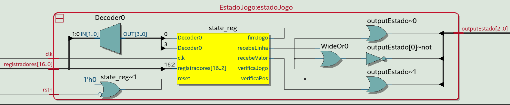

# Verilog Sudoku: Projeto prático de Circuitos Digitais

Projeto desenvolvido para a disciplina de Laboratório de Circuitos Digitais, ofertada pela UFLA.

## Desenvolvedores:

* [Gabriel Coelho Costa](https://github.com/gabrielzinCoelho)
* [Isac Gonçalves Cunha](https://github.com/Caquizeraa)

## Sobre o projeto

Foi implementado um jogo **Sudoku** utilizando o kit **FPGA DE10-Lite Altera**. Além disso, foi utilizada a linguagem de descrição de hardware **Verilog** para o desenvolvimento do projeto.

Inicialmente, o tabuleiro irá aparecer no monitor via saída VGA, a partir de um jogo sudoku já carregado na memória. O jogador preencherá o tabuleiro utilizando os switches e keys da placa e, a cada nova entrada, há uma verificação se o valor inserido está correto. O jogo é finalizado quando todo o tabuleiro for preenchido corretamente ou quando um número errado for inserido na matriz.

Além das funcionalidades básicas de um sudoku, a dupla decidiu expandir o escopo do projeto visando tornar o jogo o mais rico possível. Sendo assim, foi incrementado o **"modo dica"** (leds acesos acima dos swiches), o qual será mais detalhado adiante.

<p align="center">
  
</p>

## Detalhes da implementação

<p align="center">
  
</p>

### Caixa preta do Sudoku (PixelGen)

<p align="center">
  
</p>

Circuito responsável por implementar toda a lógica do jogo. Recebe as entradas da placa e as interpreta para o correto andamento do jogo. Além disso, recebe como entrada diversas informações referentes à renderização do jogo no monitor, provenientes do circuito **VGASync**, e tem como função determinar o valor RGB do pixel expecificado (**pixel_x** e **pixel_y**). Também manipula as demais saídas da placa, como os **leds** e **displays de sete segmentos**.

### Máquina de Estados (EstadoJogo)

<p align="center">
  
</p>

<p align="center">
  
</p>

A cada clock, o estado atual é atualizado com o valor salvo do estado seguinte (pode ser, inclusive, o próprio estado atual).

```
if(!rstn)
  state_reg <= recebeLinha;
else
	state_reg <= state_next;
```

O cálculo do próximo estado é feito considerando o estado atual e o valor salvo nos registradores. Sempre que algum dos registradores relacionados a lógica dos estados é alterado, a variável que armazena o estado seguinte é atualizada.

Todos circuitos, cada um ativo em um estado específico, executam suas funções e, para garantir que o próximo estado seja computado corretamente, atualizam os valores dos registradores associados a ele. Essa mudança é percebida pelo circuito da máquina de estados que consulta o novo valor dos registradores e avalia qual deve ser o estado seguinte.

Por exemplo, considere o estado verifica jogo. Tal estado é responsável por verificar se o valor inserido em determinada posição (já verificada como uma posição válida pelo estado anterior) constitui uma jogada válida. Além disso, ele deve determinar o resultado dessa jogada: uma jogada inválida necessariamente finaliza o jogo, porém, uma jogada válida pode encerrar o jogo ou não, dependendo do tabuleiro estar completo ou não. No caso do jogo ainda não se encerrar, todos registradores relacionados à máquina de estados devem ser resetados para que estejam disponíveis para a próxima jogada (caso contrário a máquina de estados consultaria valores antigos e pularia diversos estados).

Ainda nesse caso específico do estado de verifica jogada, dependendo da jogada feita ele pode exibir 3 saídas possíveis, que serão gravadas em seus registradores e, posteriormente, consideradas pela máquina de estados para avançar para o estado adequado. Tais saídas contam com 3 bits: o primeiro informa se o circuito já terminou sua tarefa de computar a jogada  (0 em caso negativo e 1 em caso positivo). Enquanto esse primeiro bit for 0 a máquina de estados garante que vai permancer no estado de verifica jogada. Os próximos dois bits (acertou e não acabou -> 00, acertou e acabou -> 01, errou -> 10) determinarão, então,  o pŕoximo estado.

```
case(state_reg)

  recebeLinha:
    if(registradores[16:13]) state_next = recebeColuna;
    else state_next = recebeLinha;

  recebeColuna:
    if(registradores[12:9]) state_next = verificaPos;
    else state_next = recebeColuna;

  recebeValor:
    if(registradores[8:5]) state_next = verificaJogo;
    else state_next = recebeValor;

  verificaPos:
    if(registradores[4]) begin
      if(registradores[3])
        state_next = recebeValor;
      else
        state_next = recebeLinha;
    end
    else state_next = verificaPos;

  verificaJogo:
    if(registradores[2]) begin
      case (registradores[1:0])
        2'b00:
          state_next = recebeLinha; // jogada valida e jogo em andamento
        2'b01:
          state_next = fimJogo; // jogada valida e jogo completo
        2'b10:
          state_next = fimJogo; // jogada invalida (fim jogo)
        default:
          state_next = verificaJogo;
      endcase
    end
    else state_next = verificaJogo;
    
  default:
    state_next = fimJogo;
endcase
```

### Ativador de Circuitos (DemuxEstado)

<p align="center">
  
</p>

Circuito responsável por ativar apenas o circuito associado ao estado atual.

Utiliza a saída da máquina de estados como entrada de seleção de um demultiplexador, que passa a entrada com valor 1, para a porta **enable** de apenas um dos circuitos que estão conectados.

```
case (estadoJogo)

  recebeLinha: begin
    enableRecebeEntrada <= 1;
    enableVerificaPos <= 0;
    enableVerificaJogo <= 0;
    enableFimJogo <= 0; 
  end

  recebeColuna: begin
    enableRecebeEntrada <= 1;
    enableVerificaPos <= 0;
    enableVerificaJogo <= 0;
    enableFimJogo <= 0; 
  end

  recebeValor: begin
    enableRecebeEntrada <= 1;
    enableVerificaPos <= 0;
    enableVerificaJogo <= 0;
    enableFimJogo <= 0; 
  end

  verificaPos: begin
    enableRecebeEntrada <= 0;
    enableVerificaPos <= 1;
    enableVerificaJogo <= 0;
    enableFimJogo <= 0; 
  end

  verificaJogo: begin
    enableRecebeEntrada <= 0;
    enableVerificaPos <= 0;
    enableVerificaJogo <= 1;
    enableFimJogo <= 0; 
  end

  fimJogo: begin
    enableRecebeEntrada <= 0;
    enableVerificaPos <= 0;
    enableVerificaJogo <= 0;
    enableFimJogo <= 1; 
  end

  default: begin
    enableRecebeEntrada <= 1;
    enableVerificaPos <= 0;
    enableVerificaJogo <= 0;
    enableFimJogo <= 0; 
  end
      
endcase
```

### Circuito Detector de Borda (Edge Detector)

###### * EdgeDetector: Código de autoria do docente [Bruno de Abreu](https://github.com/brabreus)

<p align="center">
  
</p>

O circuito detector de borda é responsável por transformar o pressionamento de um dos botões (EnterKey e ResetKey), que pode perdurar por vários clock's, em apenas um pulso de clock.

Para isso, ele conta com dois **FF's do tipo D** conectados em série.  A saída é o resultado de uma porta **AND** com o valor salvo no primeiro FF e a negação do valor salvo no segundo FF. Nesse caso, a saída ocorre em nível alto se a saída do primeiro FF for 1 e do segundo for 0. Logo, o circuito se torna sensível apenas ao primeiro clock em que um dos botões é pressionado (visto que nos próximos clock, enquanto o botão se mantém pressionado o segundo flip-flop irá receber a entrada em nível alto do primeiro flip-flop).

```
assign rising_edge = ~ffs[1] & ffs[0];
```
```
pulse <= (rstn == 0) ? 1'b0 : rising_edge;
```

### Sincronizadores Switches (AsyncSwitchSynchronizer)

<p align="center">
  
</p>

Circuito responsável por receber os swiches da placa e os sincroniza com o sinal de clock.

Cada um dos switches é sincronziado individualmente pelo circuito **AsyncInputSincronizer** e a saída dos dez switches sincronizados é comprimida em um array de 10 bits. 

O circuito **AsyncInputSincronizer** possui dois **flip-flops do tipo D** conectados em série e ativos na borda de subida do clock. Dessa forma, há maior confiabilidade no valor de saída produzido pelo circuito.

###### * AsyncInputSincronizer: Código de autoria do docente [Bruno de Abreu](https://github.com/brabreus)

```
if(asyncn == 0) begin
		first_ff <= 0;
		second_ff <= 0;
end
else begin
		first_ff <= 1;
		second_ff <= first_ff;
end	
```
```
assign syncn = second_ff;
```

### Registradores

<p align="center">
  
</p>

Os registradores são responsáveis por salvar dados que podem ser acessíveis por outros circuitos. Possuem uma entrada **enable**, que quando ativa em alto permite que novos valores sejam sobreescritos, e uma entrada **clear**, que reseta o valor salvo para o valor inicial.

O projeto conta com inúmeros desses circuitos instanciados de forma que, em conjunto, eles armazenam o estado global do jogo. Dessa forma, eles permitem que diferentes circuitos se comuniquem e que a máquina de estados possa determinar de maneira correta qual tarefa deve ser executada em determinado momento. Assim, os demais circuitos do sistema atualizam os valores dos registradores e também os consultam para garantir o funcionamento do jogo.

Ao todo são 7 registradores: **linha**, **coluna**, **valor**, **posicaoValida**, **verificaJogo**, **sudokuJogador**, **sudokuFinal**.

No momento da criação de cada um deles, o **Verilog** permite que sejam especificados parâmetros de instanciação. Nesse caso, cada registrador é criado com uma capacidade de armazenamento (número de bits) e com um valor inicial específicos. Assim, o circuito se adapta melhor a cada necessidade, se torna mais flexível e permite a sua reutilização em diferentes contextos.

```
if(!rstn)
	valorSalvo <= valorInicial;
else begin
	if(enable)
		valorSalvo <= dadoEntrada;
	else
		valorSalvo <= valorSalvo;
end
```
```
dadoSaida <= valorSalvo;
```

### Codificador dos Switches (CodificadorSwitch)

Circuito que atua como um **codificador de prioridade** e converte o valor dos switches em um número entre **1 e 9** (linha, coluna ou valor).

Cada switch é associado a um número no intervalo de 1 a 9 e, dessa forma, ele captura o switch com o valor mais alto e ignora o estado dos anteriores.

```
casex (switch)
	9'b1xxxxxxxx: switchCod = 4'd9;
	9'b01xxxxxxx: switchCod = 4'd8;
	9'b001xxxxxx: switchCod = 4'd7;
	9'b0001xxxxx: switchCod = 4'd6;
	9'b00001xxxx: switchCod = 4'd5;
	9'b000001xxx: switchCod = 4'd4;
	9'b0000001xx: switchCod = 4'd3;
	9'b00000001x: switchCod = 4'd2;
	9'b000000001: switchCod = 4'd1;
	default: switchCod = 4'd0;
endcase
```

### Recebe Entradas do Usuário (RecebeEntradas)

<p align="center">
  
</p>

Circuito responsável por capturar a entrada do usuário nos switches e, dependendo do estado atual (máquina de estados), repassar esse valor para o registrador referente (linha, coluna ou valor).

Assim, ele utiliza o estado atual (proveniente da máquina de estados) como entrada de seleção para um demultiplexador que recebe o valor 1 na entrada e o transmite como enable a apenas um dos registradores. Dessa forma, ele passa a saída codificada dos switches para todos os registradores (linha, coluna e valor), mas apenas um deles recebe o sinal de enable em alto. 

```
if(keyEnter) begin // demux  registradores
			
	case (estadoJogo)
    3'b000: begin
      enableLinha = 1;
      enableColuna = 0;
      enableValor = 0;
    end
    
    3'b001: begin	
      enableLinha = 0;
      enableColuna = 1;
      enableValor = 0;
    end

    3'b011: begin
      enableLinha = 0;
      enableColuna = 0;
      enableValor = 1;
    end

    default: begin
      enableLinha = 0;
      enableColuna = 0;
      enableValor = 0;
    end
  endcase
  
end
```

### Mostra Entradas do Usuário (MostraEntradas)

<p align="center">
  
</p>

### Verifica Posição Escolhida pelo Usuário (VerificaPosicao)

### Verifica Jogada Feita pelo Usuário (VerificaJogada)

### Reseta Entradas do Usuário (ResetaEntrada)

<p align="center">
  
</p>

### Fim de Jogo (FimJogo)

<p align="center">
  
</p>

### Renderiza Saída no Monitor (Tabuleiro)

<p align="center">
  
</p>

### Modo Fornece Dicas (ModoDica)

